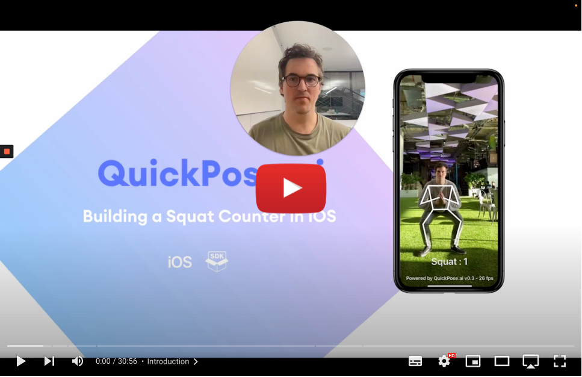

# example-ios-squat-counter

This repo contains sample code developed in the building an iOS squat counter tutorial.

QuickPose provides developer-oriented cutting edge AI fitness features, with easy integration and production ready code. Dramatically improving the speed of implementation for mobile applications.

For official repo and installation instructions ---> [https://github.com/quickpose/quickpose-ios-sdk
](https://github.com/quickpose/quickpose-ios-sdk)

